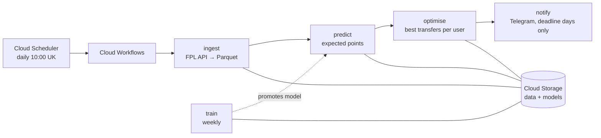

# FPL Optimiser

[](https://github.com/jameso127/fpl-optimiser/actions/workflows/ci.yml)

**A bot that tells you which Fantasy Premier League transfers to make, and why.**

Every gameweek it predicts how many points each of the ~700 Premier League players will score,
works out the best transfers for your team, and messages you the advice on Telegram on the
morning of the deadline. It runs on Google Cloud for under £2 a month.

> **In short:** an end-to-end ML project. It covers data ingestion, a trained and backtested
> model, a mathematical optimiser and a deployed, scheduled pipeline, with CI/CD and
> infrastructure as code.

## What you get

On deadline day, a message like this (from the test data, so the names are placeholders):

```
Gameweek 3
Make 1 transfer: +2.3 points (no hit).

Transfers
OUT P45 (C05, £10.0m)
IN  P71 (C08, £10.5m)

Starting XI (xPts)
GK  P64               C08   2.3
DEF P47               C06   2.3
...
FWD P71 (C)           C08   7.0
FWD P44 (V)           C05   4.0
Bench: P28, P58, P88, P03

All options
hold: 36.8 pts (+0.0)
1 transfer: 39.0 pts (+2.3)
2 transfers: 39.1 pts, -4 hit (+2.4)
3 transfers: 36.5 pts, -8 hit (-0.2)

Based on
• Your team as FPL shows it after the gameweek 2 deadline.
• Free transfers left: 1 (estimated).
```

Here, 2 transfers score slightly higher than 1, but the bot still says 1. Predictions are
noisy, so every extra transfer has to earn at least half a point to be worth recommending.

## Does the model work?

Yes, and the backtest checks it honestly. Every gameweek is predicted by a model that has only
seen earlier data ([full report](docs/backtest.md)):

| Head to head | Model | Other | Avg points of each gameweek's top-30 picks |
|---|---|---|---|
| vs a simple "recent form" baseline | **4.45** | 3.76 | model wins |
| vs FPL's own expected points (`ep_next`)* | **4.52** | 3.93 | model wins |

\* on the 9 gameweeks where FPL's pre-deadline figure is available.

Honest caveat: it only just beats my first, simpler model (4.45 vs 4.40), and most of the extra
features don't earn their place yet. They're candidates to prune as more data comes in.

One lesson from building it: an early version made FPL's own numbers look better than the
model. That turned out to be **data leakage**: the archived value secretly contained the result
it was meant to predict. The backtest now checks for this leak on every run.

## How it works



| Step | What it does |
|---|---|
| `ingest` | Saves a snapshot of the official FPL API (players, teams, fixtures, results). |
| `train` | Trains a model weekly, tests it, and only puts it live if it passes a quality gate. |
| `predict` | Uses the live model to predict every player's points for the next gameweek. |
| `optimise` | Finds each user's best team for 0, 1, 2… transfers, including the 4-point hits. |
| `notify` | Sends each user their advice on Telegram, only on deadline days and never twice. |

Each step is a small container that runs, does its job and stops, so it costs nothing while
idle.

## Engineering highlights

- **Optimisation as a maths problem.** The squad rules (15 players, 2/5/5/3 by position, at most
  3 per club, the budget, a valid formation, a captain) are encoded as a mixed-integer program
  and solved exactly with HiGHS (via SciPy).
- **Training is separate from serving.** Every trained model is saved with a "model card" (data
  hash, features, parameters, git commit). A new model only goes live if it beats both
  baselines and the current model, and `predict` refuses to run if the features don't match.
- **Handles the messy reality.** FPL hides transfers you've already made until the deadline
  passes, so users can tell the bot about them. Every message lists the assumptions it rests on.
- **Safe to re-run.** Each job overwrites its own output, and sending is an atomic "claim", so a
  retry never sends a message twice.
- **Tested.** About 180 tests using fake data sources, plus contract tests that run the same
  suite against the real database (Firestore emulator) and an in-memory version.
- **Shipped through CI/CD.** Pull requests run lint, type checks, tests and Docker builds. Merging
  deploys only the parts that changed, using short-lived credentials and no stored keys.

## Tech stack

Python 3.12 · pandas · LightGBM · SciPy (HiGHS MILP) · Parquet · Docker ·
Google Cloud (Cloud Run Jobs, Workflows, Scheduler, Cloud Storage, Firestore, Secret Manager) ·
Terraform · GitHub Actions · uv · ruff · mypy · pytest

## Run it yourself

You need [uv](https://docs.astral.sh/uv/). Copy `.env.example` to `.env` and fill in your FPL
team id, a Telegram bot token (from @BotFather) and your chat id.

```
uv sync
uv run python -m ingest.history   # once: download past seasons to train on
uv run python -m ingest.main      # today's FPL data -> ./data
uv run python -m train.main       # train, test and (maybe) promote a model
uv run python -m predict.main
uv run python -m optimise.main
FORCE_NOTIFY=true uv run python -m notify.main   # send the message now
```

`make pipeline` runs ingest through optimise; `make lint` and `make test` run the checks.

## Repo layout

```
ingest/     FPL API -> Parquet, plus the one-off history import
ml/         features, model, registry, promotion gate, monitoring, backtest
train/      predict/     optimise/     notify/     one Cloud Run job each, with its Dockerfile
common/     shared settings, logging, storage, FPL client, users store, deadline rule
tests/      unit and contract tests, with fake data sources
docs/       backtest report
```

## Related repos

- [fpl-optimiser-infra](https://github.com/jameso127/fpl-optimiser-infra): all the Google Cloud
  infrastructure as Terraform (jobs, scheduler, workflow, storage, IAM, budget alerts).

## Status and next steps

- **Running:** all five jobs, deployed to Google Cloud by GitHub Actions on a daily schedule.
- **Next:** an interactive Telegram bot (sign up with an invite, `/xi`, tell it about your
  transfers) and a web frontend.
- **Known limit:** the pipeline runs at 10:00 UK, so a deadline earlier than that is missed.

`archive/` holds the original single-file version of the optimiser, kept for comparison.
